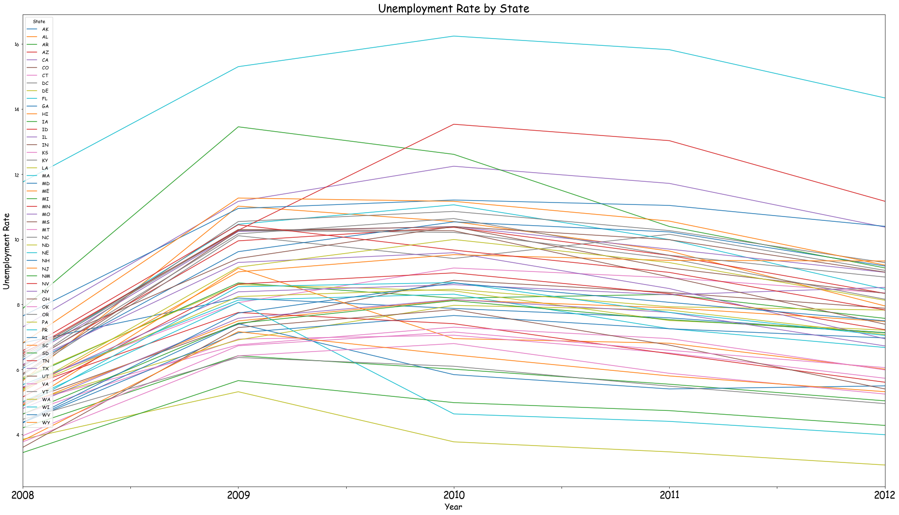
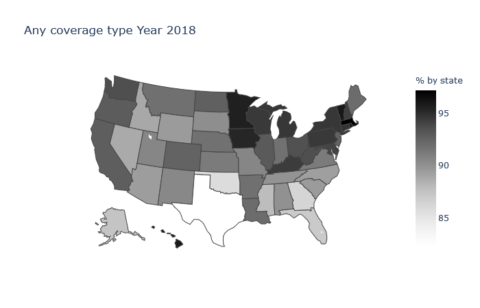
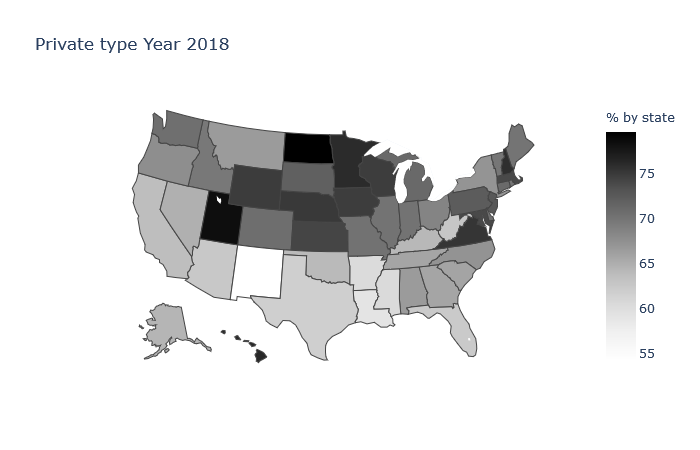
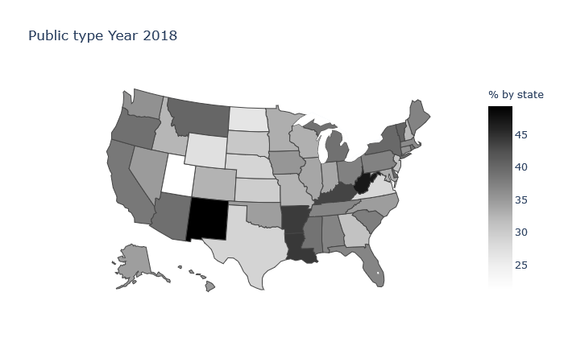
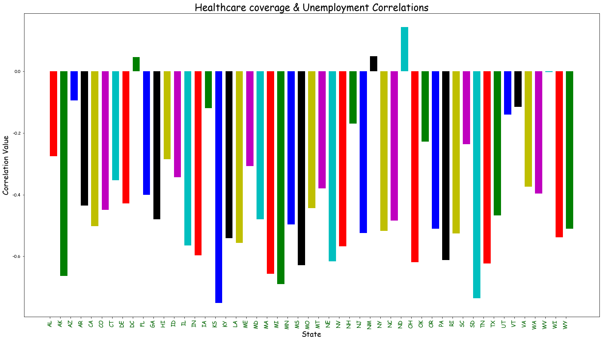
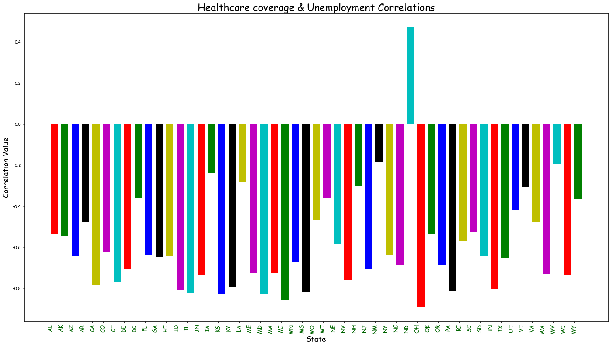
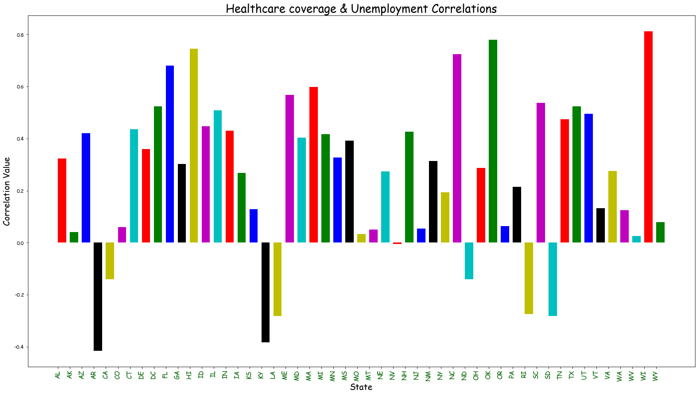
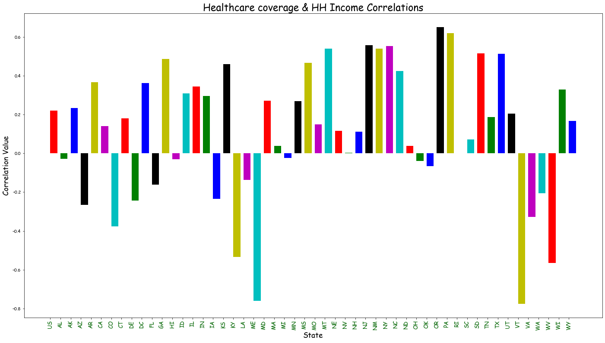
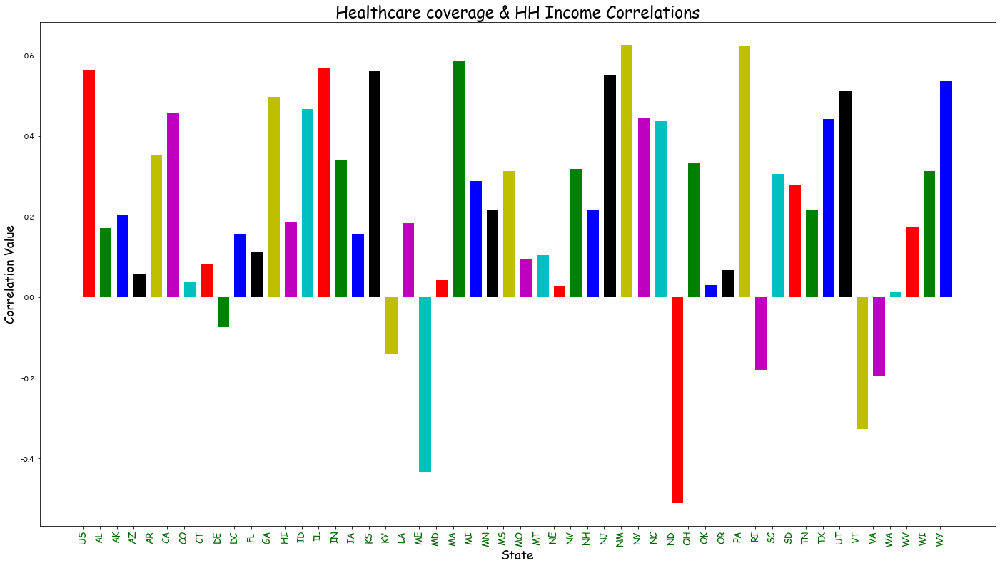
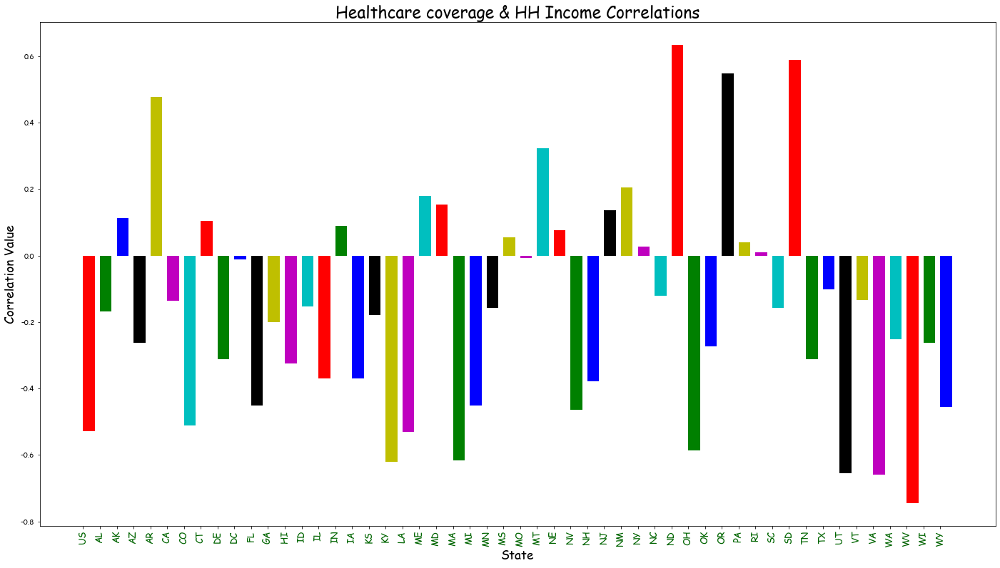

## Programming Analytics Final Project: How does Unemployment Rate impact Insurance Coverage Ratio in different regions within the United States?
### Team Members:
* Yuttawee Kongtananan (GitHub ID: yuttk)
* Vel (Tien-Yun) Wu (GitHub ID: velwu)
* Eva (Yi-Ting) Huang (GitHub ID: iameva62948)

## Datasets of interest
* Insurance Coverage.

* Spending per Household.

* Expenses paid for by insurance companies for their customers.

Source of Data: HIC-4. Health Insurance Coverage Status and Type of Coverage by State--All Persons: 2008 to 2018. Can be downloaded from: https://www.census.gov/library/publications/2019/demo/p60-267.html#

Healthcare coverage
https://www.census.gov/library/publications/2019/demo/p60-267.html#

National Center for Health Statistics
https://cdc.gov/nchs/nhis/nhis_2017_data_release.htm?fbclid=IwAR2s1_ur8ElTtcGjPHKl1zN7D0slSoTbLggHBFRR8X-awwF_YLCJIgvn_4Q

Us Census Bureau:Income Data Tables
https://www.census.gov/topics/income-poverty/income/data/tables.html

Consumer Price Index
https://www.bls.gov/cpi/

Some news: https://www.vox.com/policy-and-politics/2019/9/10/20858938/health-insurance-census-bureau-data-trump?fbclid=IwAR2s1_ur8ElTtcGjPHKl1zN7D0slSoTbLggHBFRR8X-awwF_YLCJIgvn_4Q

Some other sources: https://www.cdc.gov/nchs/nhis/nhis_2017_data_release.htm?fbclid=IwAR2s1_ur8ElTtcGjPHKl1zN7D0slSoTbLggHBFRR8X-awwF_YLCJIgvn_4Q

## Files: Py and Ipynb
### 1. central_analysis.py
- This is the main file. Everything what our project does programmatically is done here. Codes here are built on those originated from **2.** and **3.** below. Most are, suffice to say, overhauled to the point where parameters are no longer hard-coded, but instead follow the general object-oriented programming structure.

### 2. data_exploration.ipynb & data_exploration_2.ipynb
- There are multiple files of these names but they are more like test spaces where we try out codes to look at the datasets before putting functional codes into "central_analysis.py". Specifically, "data_exploration_2.ipynb" is built on "data_exploration.ipynb" with more visualization though parameters and data passages are still mostly hard-coded.

### 3. Household_Income.ipynb & Household_Income2.ipynb
- Household incomes are read and parsed in ways that allow them to return an uniform data structure which can be passed into different functions to create different visualizations. 

### 4. presentation_caller.ipynb
- This is the file we mainly use for demonstrations. It imports several popular libraries plus "central_analysis.py" as dependencies. Viewers of our codes may also run this file to observe the datasets in a comprehensive, interactive way.

## Project Description
IS 590 PR - Progr Analytics & Data Process Final Project Proposal (Type II)
Researh Question:
How does Unemployment Rate impact Insurance Coverage Ratio in different regions within the United States?

Attached to this proposal is a Data Exploration done using Jupyter Notebook, accessible through this link to our GitHub Repository:
https://github.com/velwu/employment_and_insurance_project

Hypotheses:
 1) There is a negative linear correlation between local unemployment rate and insurance coverage ratio in each state.
 2) The effects of unemployment rate on insurance coverage ratio & each type of insurance are not equal.
 3) There is a positive linear correlation between the insurance coverage ratio and household income.
 4) There is no significant discrepancy between said correlations found in different states.
		 	 	 					
I. Project Objective:

Contrary to countries like Japan, Taiwan and many in Europe, The United States does not have all its social / health insurance systems run by the central government. Instead, most citizens are financially responsible for the costs and responsibilities of their health insurance. In most cases, the primary health insurance coverage for an American resident comes in limited capacity through:
 1) Publicly operated insurance, such as Medicaid and Medicare.
 2) Direct-purchased insurance, through private insurance companies.
 3) Employer-based insurance, which purchase through financially capable employers from employment status of employees.

People who is not included in insurance plan above could end up paying medical expenses themselves, this group of people called uninsured people.
This project aims to address the relationship between unemployment rate and insurance coverage ratio within the United States.
By analyzing data describing medical insurances, unemployment rates, and demographics in each state, we embark on a journey to investigate how much unemployment rates affect insurance coverage ratios and the shares of each insurance type in various regions.

II. Datasets Description

Datasets and other variables we use will be collected from sources such as U.S. CENSUS BUREAU and U.S. BUREAU OF LABOR STATISTICS, both of which serve as primary subjects of this project.
 1) Local Area Unemployment Statistics - https://www.bls.gov/lau/lastrk19.htm

    Dataset description: This website includes data describing monthly and annual employment, unemployment, and labor force traits within Census regions, divisions, States, counties, cities, metropolitan areas, and residences / settlements of other forms.
    In the analysis, we will select some variables from the data as independent variables in terms of demographics and economy.			
 2) Health Insurance Coverage Status and Type of Coverage by State from 2008 to 2018 - https://www.census.gov/library/publications/2019/demo/p60-267.html#
 
    Dataset description: This report presents statistics on health insurance coverage in the United States from 2008 to 2018.
    The dataset also contains different insurance categories as dependent variables.

    Public Coverage
    
    • Employment-based: Plan provided by an employer or union
    
    • Direct-purchase: Coverage purchased directly from an insurance company or through a federal or state marketplace (e.g., healthcare. Gov).

    • TRICARE: Coverage through TRICARE, formerly known as the Civilian Health and Medical Program of the Uniformed Services.

    Private Coverage

    • Medicare: Federal program which compensates healthcare costs for people of or over the age of 65, plus those under 65 but with long-term disabilities.
 
    • Medicaid: State and federal program for low-income people and children (CHIP).

    • CHAMPVA or VA: Civilian Health and Medical Program of the Department of Veterans Affairs, as well as care provided by the Department of Veterans Affairs and the military.

## Findings and Analysis

### Unemployment rate trend

According to the unemployment rate data, the unemployment rate was increasing in 2008 to 2009, then it has been decreasing since 2009. 
The explanation is that there is Hamburger crisis in 2008 and it affect the US economy, which lead to the increasing of the unemployment rate in 2009. 
However, the US economy was back on track after that, the situation is getting better over year, which set decreasing trend to the unemployment rate.

### insurance coverage by state

In terms of insurance coverage ratio in 2018, people in the north part and north-east have more insurance compare to people in the other parts of the country.

This characteristic is also true for the private insurance, consist of Employed-based and Direct-purchase insurance, this could mean people in the north and the north-east have more jobs or decided to buy insurance more, compare to people in the other parts of the country. 

However, if we focus on public insurance, the picture is different, people in the south have more coverage compare to the other parts.
Why is that?

Normally, elder, disabled, and low-income people are eligible to public insurance, because the objective of public insurance is to help people who cannot afford the price of private insurance. 
Consequently, it makes sense that people in the south, who have less private insurance coverage, have more public insurance coverage.

### Hypothesis 1: There is a negative linear correlation between local unemployment rate and insurance coverage ratio in each state

From the correlation results between unemployment rate and any type of insurance coverage ratio, it is obvious that unemployment rate has some effect on the insurance coverage ratio.
Most of the states have negative correlations between unemployment rate and any type of insurance coverage ratio.

Hypothesis 1 is TRUE

### Hypothesis 2: The effects of unemployment rate on insurance coverage ratio & each type of insurance are not equal

  
The negative correlations also happen for private insurance coverage, most of the states also have negative correlations.
There are two reasons to explain the connection between the unemployment rate and the private insurance coverage ratio (consist of Employer-based and Direct-purchase insurance).
First, when people lose their jobs, they lose their Employer-based insurance.
Second, when people lose their jobs, they also have less income to pay for Direct-purchase income.

However, for public insurance coverage, the unemployment rate seems to has positive effect on it.
As mentioned before, the public insurance has people who cannot afford the price of private income as a target group. 
Unemployment status makes people have less ability to pay for private insurance, then people will need public insurance to cover their medical expenses.

Hypothesis 2 is TRUE

### Hypothesis 3: There is a positive linear correlation between the insurance coverage ratio and household income

Because we have an assumption that when people have more income, they may want to buy more insurance, so we investigated in two datasets.
Insurance coverage ratio and household income in each state.

We found that the correlations between any type of insurance coverage ratio and household income by state are mixed.
So we cannot clearly identify impact of household income on any insurance coverage ratio.

However, if we breakdown to private insurance, we can see that most of the states have positive correlations.
This positive correlations happened maybe because when people have more money they tend to buy more insurance (Increase Direct-purchase insurance), or people have more income may indicate they have more jobs (Increase Employer-based insurance). 

For public insurance, the correlations by state are mixed, this is the same as the case of any type of insurance.
So we cannot find an obvious connection between public insurance coverage ration and household income.    

Hypothesis 3 is FALSE

### Hypothesis 4: There is no significant discrepancy between said correlations found in different states

As you can see from the histograms of correlation in the other hypotheses, there are differences in the size of correlations between states.
So we cannot conclude that their is no significant discrepancy of correlations between states.

Hypothesis 4 is FALSE

## Conclusion  

From the health insurance payment systems of the US, employers need to pay for health insurance for their employees.
Consequently, unemployment rate should has an effect on health insurance coverage ratio. 
As we see from the analysis, unemployment rate has negative effect on insurance coverage ratio (Negative correlation). 
However, if we focus on the public insurance coverage ratio, we will see that unemployment rate has positive effect on it (Positive correlation).
This happen because public insurance aim to help people who cannot afford private insurance, so when people lose their jobs their can switch to apply for public insurance instead.

In terms of household income and insurance coverage ratio, there is no clear connection between them. 
We also cannot find clear connection between household income and public insurance coverage ratio.
Nevertheless, if we breakdown to private insurance we can see that household income has positive impact to insurance coverage.
Maybe this positive impact cause from two reasons. 
First, people tend to buy more insurance when they have more money. 
Second, when people have more income, it may indicate that they have more jobs that will increase one type of private insurance, Employer-based insurance coverage.     

## Limitations

From the correlation results, it seems there is clear connection between unemployment rate and insurance coverage ratio.
However, the increasing of insurance coverage ratio since 2014 might cause by the Affordable Care Act (ACA) or Obamacare, which aim to make insurance price affordable to American people.
ACA has two essential goals to support people that may significantly affect the coverage. 
First, ACA subsidy insurance premium of private insurance for low-income people.
Second, ACA expand Medicaid program, one of public insurance, to cover adults who have low-income.

## TODO:
- 1. Refute or support our existing hypotheses
- 2. Doctests (Yuttawee)
- 3. Automated testing using TravisCI (Vel)
- 3b. Currently cannot get TravisCI to work pass the failure in installing packages. Might need to switch to GitHub Actions if this continues to prove difficult.
- 4. Optimization using Numba (Yi-Ting)
